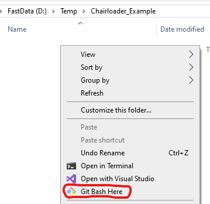
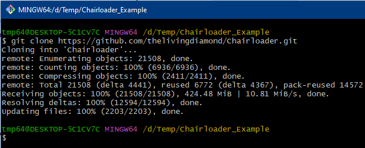
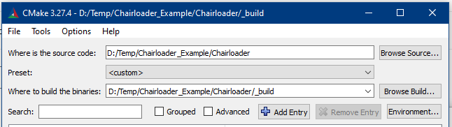
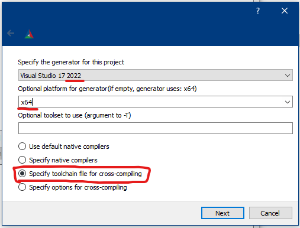
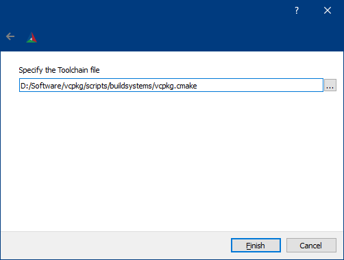
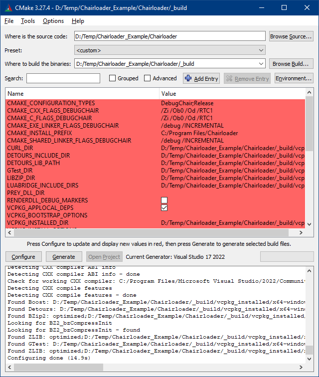
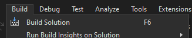
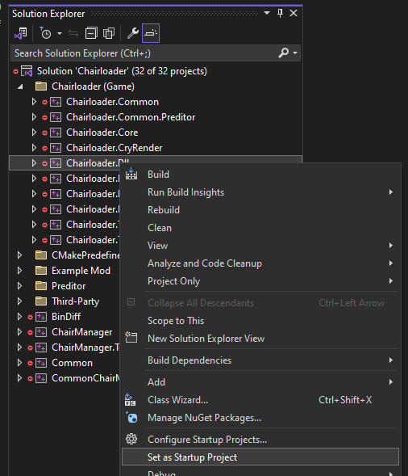
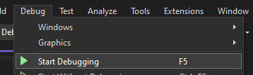

# Building Chairloader
Before you can start making C++ mods, you have to build Chairloader from source code on your computer. This ensures that you have a development environment ready and can, if necessary, step into Chairloader code when debugging.

## Prerequisites
You must install the following software:

1. [Visual Studio 2022 or newer](https://visualstudio.microsoft.com) (*do not* confuse with Visual Studio *Code*)
   - Community version will suffice
   - When installing, select:
     - Workloads:
       - Desktop development with C++
     - Individual components:
       - C++ MFC for latest build tools (x86 & x64)
       - C++ ATL for latest build tools (x86 & x64)
2. [Git for Windows](https://git-scm.com/download/win)
3. [CMake](https://cmake.org/download/) (Latest Release, Windows x64 Installer)
4. vcpkg
   - Follow only [Step 1 - Set up vcpkg](https://learn.microsoft.com/en-us/vcpkg/get_started/get-started?pivots=shell-cmd#1---set-up-vcpkg).
     You don't need to do the rest

## Step 1. Cloning Chairloader repo
1. Create a folder somewhere for Chairloader
2. Right-Click and select "Git Bash Here"  
   
3. Copy & Paste this command in the opened console window
   - **DO NOT** use Ctrl+V. It doesn't paste text. Right-Click instead and select "Paste".
   ```bash
   git clone https://github.com/thelivingdiamond/Chairloader.git
   ```  
   

## Step 2. Generating VS solution using CMake
1. Open the `Chairloader` folder with the source code.
2. Create a folder named `_build`
3. Open CMake GUI
4. Set "Where is the source code" to the folder with Chairloader source code
5. Set "Where to build the binaries" to the created `_build` folder  
   
6. Press "Configure" at the bottom. Configuration dialog will open.
7. Select:
   - Specify the generator for this project: your Visual Studio version
   - Optional platform for generator: x64
   - "Specify toolchain file for cross-compiling"
   
   
8. Click Next.
9. Specify the Toolchain file: `path_to_vcpkg/scripts/buildsystems/vcpkg.cmake`  
   
10. Press Finish.
11. Wait for all dependencies to download and build. This may take up to 10 minutes but it will only happen once.
12. You should see something like this:  
    
13. Set `PREY_DLL_DIR` to where `PreyDll.dll` is.  
    Example: `F:/Games/SteamLibrary/steamapps/common/Prey/Binaries/Danielle/x64/Release`
14. Press "Configure" and "Generate"

## Step 3. Building Chairloader
1. In CMake, press "Open Project"
   - Or open `Chairloader.sln` file manually. It will be located in `_build` folder
2. Visual Studio will open. Press "Build" -> "Build Solution".  
   
3. Wait for everything to build
4. Output window should contain this:
   ```
   ========== Build: 30 succeeded, 0 failed, 0 up-to-date, 2 skipped ==========
   ========== Build completed at 10:10 and took 01:38,606 minutes ==========
   ```
5. In Solution Explorer, navigate to "Chairloader (Game)" -> "Chairloader.Dll"
6. Right-Click and select "Set as Startup Project"  
   
7. Press "Debug" -> "Start Debugging"  
   
8. The game with Chairloader in Developer Mode will start

## Alternative IDEs and Compilers
> **Note:** This is an advanced section for experienced C++ developers

Alternatively, you can use CLion, Rider or VS Code. But you must use the Visual Studio Build Tools compiler. There is no guide on how to set everything up. You're on you own.

Chairloader can be built using `clang-cl` compiler in MSVC compatibility mode. But that mode still requires you to install Visual Studio Build Tools.

MSYS2 compilers are not supported.