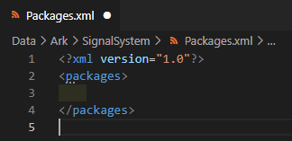
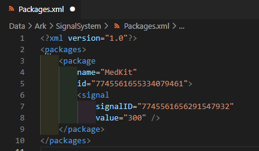
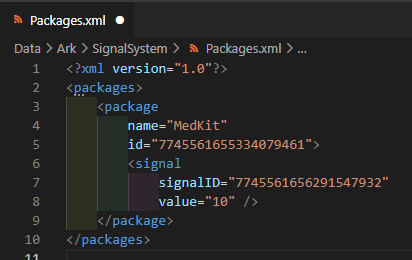

# Basic XML Mod
This article will guide you how to make a simple XML mod that changes the amount of health that Medkits restore. This guide implies that you use VS Code and shows you a way to search for things in game files.

## Prerequisites
1. [Create an empty mod](../introduction.md)
2. Install Visual Studio Code as specified in the article linked above

## Step 1. Looking for what to change
1. Open `ChairManager/PreyFiles` in VS Code. This folder contains all XML files that you can mod.
2. Press `Ctrl+Shift+F` to open Search All Files.
3. Type `medkit`. This will show a large number of results.
4. Press "View as Tree" and "Collapse All" buttons at the top to make it easier to navigate.
5. Entities (e.g. interactive objects) are defined in `Libs/EntityArchetypes`. Open the first search result in `Libs/EntityArchetypes/ArkPickups.xml`.
   ```xml
    <EntityPrototype
        Name="Medical.MedKit"
        Id="{58D44466-33E6-491B-B0F1-9FE4B0FAE192}"
        Library="ArkPickups"
        Class="ArkMedKit"
        Description=""
        ArchetypeId="10739735956144611826">
        <Properties
            metaTags_ArkMetaTags="3149325216955299302"
            bAvailableForRandom="1"
       ...
   ```
6. The game uses *signals* to apply effects like damage or healing. Navigate to `AppliedOnConsume` element.
   ```xml
            <AppliedOnConsume
                es_RestoredPoints="HEALTH"
                signalpackage_SignalPackage="7745561655334079461">
                <OptionalAbilityRequirement
                    ability_AbilityRequirement="3149325216929346739"
                    signalpackage_AbilityRequirementSignalPackage="10641886185836882035" />
            </AppliedOnConsume>
   ```
7. This element states that when a medkit is comsumed, *signal package* with ID `7745561655334079461` is sent to the player.  
   Signal package is a combination of signals and their values sent at once.
8. Press `Ctrl+Shift+F` and search for `7745561655334079461`.
9. Open the result in `Ark/SignalSystem/Packages.xml`.
   ```xml
    <package
        name="MedKit"
        id="7745561655334079461">
        <signal
            signalID="7745561656291547932"
            value="300" />
   ```
10. It states that this package will create a signal with ID `7745561656291547932` and value `300` (30 health points).
   - You can search all files for `7745561656291547932`. Open the result in `Ark/SignalSystem/Signals.xml` to find out what that signal actually is.
12. You will need to change the value `300` to a different one.

## Step 2. Modifying the file
1. Open your mod folder in VS Code. Create a folder named `Data`.  
    
2. Create the folders `Ark/SignalSystem` and create an empty file named `Packages.xml`  
    
3. Copy and paste the root objects from the original file. Don't forget to close the `<packages>` tag.  
    
4. Copy and paste the element for package with ID `7745561655334079461`  
    
5. Change the value to something else. In this case, `10` (1 hp).  
    
6. Save the file by pressing `Ctrl+S`

## Step 3. Applying and testing
1. Apply the changes in the game:
    - Preditor: Restart Predtior. It will merge the files automatically.
    - Game: Press "Merge Mods" in ChairManager
2. Try it out. Launch Preditor/Game
3. In Debug Menu at the top, press `Campaign -> Clean Load Level -> Lobby`
4. Jump down to take damage
5. Spawn a medkit: `Debug Menu -> Items ->Give Item: -> MedKit`
6. Use the medkit and check how much health was restored
   - Alternatively, check the description of the Medkit item

## Conclusion
You now have a basic understanding of how XML mods work, how to look for things to change and how to make an XML mod.
