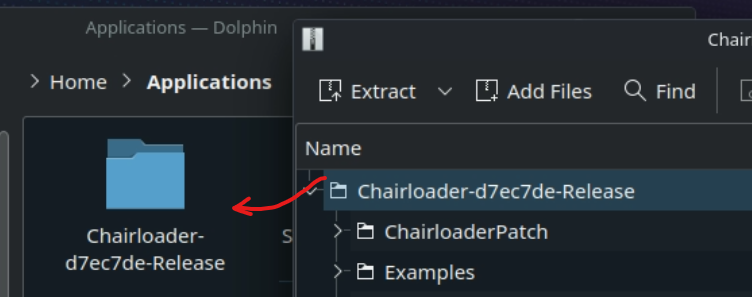
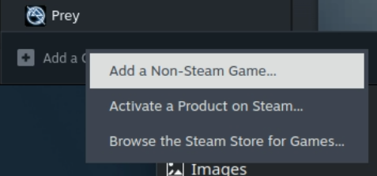

# Steam Deck & Linux Installation Guide
## Step 1. Install Chairloader Mod Manager
1. (Steam Deck) Switch to Desktop Mode
2. Download the latest release archive
3. Extract the archive to `/home/deck/Applications/`  
   
4. Open Steam, Add a Game -> Add Non-Steam Game -> Browse...  
   
5. Browse to `ChairManager.exe`
6. Right-Click ChairManager -> Properties -> Compatibility -> Force the use of a specific Steam Play compat tool
7. Select Proton Experimental
8. Close the window and launch ChairManager.exe
9. Continue installation normally. Game may be located in:
   - Internal storage: `/home/deck/.local/share/Steam/steamapps/common/Prey`
   - SD Card: `/run/media/deck/[long id]/steamapps/common/Prey`

## Step 2. Setting up the game
1. Select Prey in Steam Library
2. Right-Click -> Properties -> General
3. Type in the launch options:
   ```
   WINEDLLOVERRIDES="mswsock.dll=n,b" %command%
   ```
4. Close the window
5. Launch Prey