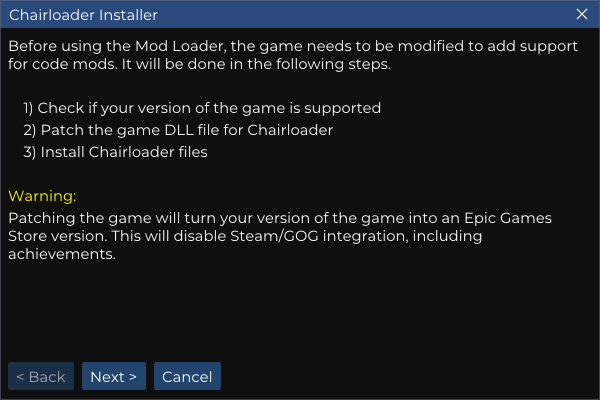
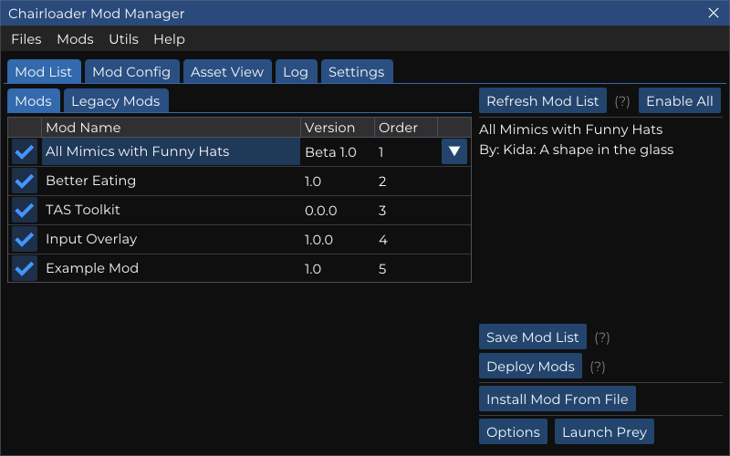
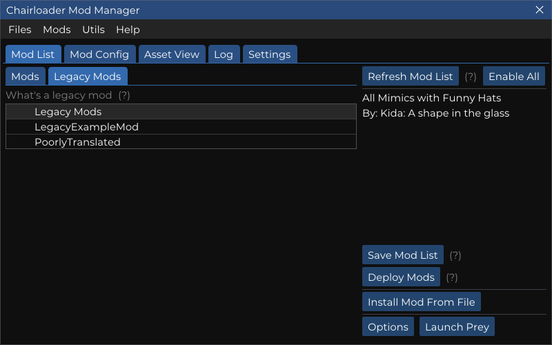
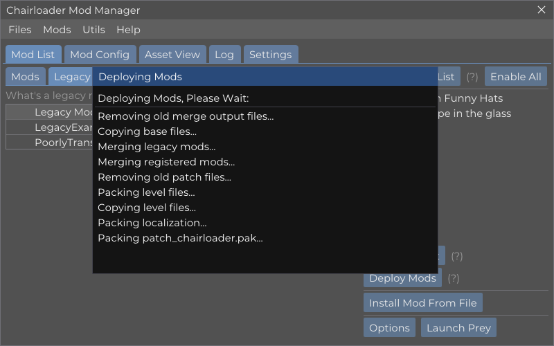
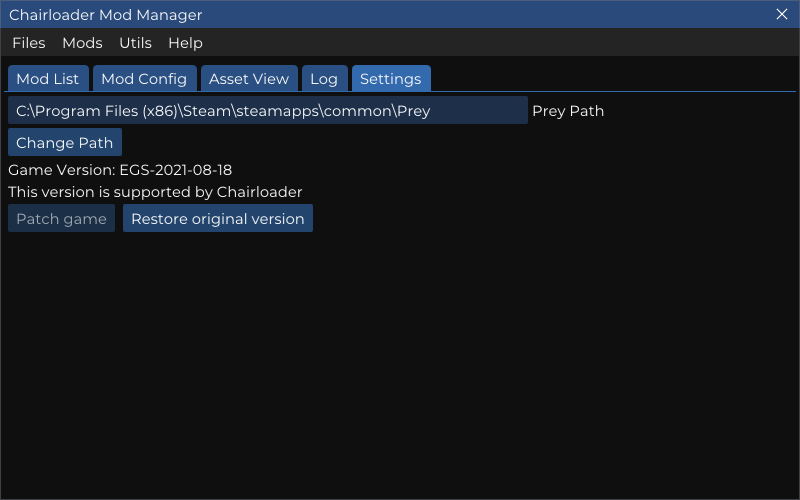

# Chairloader Mod Manager
#### **A mod Manager and merger for Prey (2017) Mods**

### Key Features

- Install mods from .zip or .7z file
- Install legacy mods from .pak
- Enable and disable mods from loading through Chairloader
- Easy Chairloader install and uninstall wizards
- Automatic DLL patching to add Chairloader support
- Asset management and patching
- **Merging XML based asset files**
    - Base asset files *and* level files are supported
    - Localization file support coming soon!
- Supports merging "Legacy" mods

### Easy Install Wizard for Chairloader

### Intuitive Mod Management Interface

### Legacy Mod Support

### Mod Merging and Deployment

### Game DLL Patching to enable Chairloader Support on Steam/GOG

