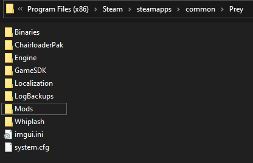
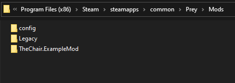
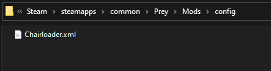
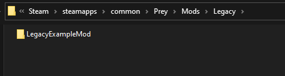
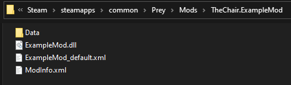
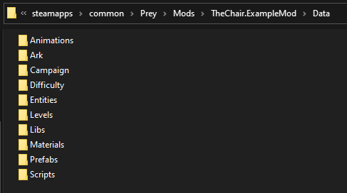
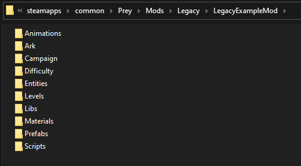

## Proper file structure for Prey directory
This is how the Prey directory should look once you have installed Chairloader. The `Mods` folder is created automatically when installed.

## Proper file structure for Mods folder
The Mods folder should have two folders inside of it upon first creation, `config` and `Legacy`. Any Chairloader mods should go here, and they are automatically placed here by the install mod from file function.

#### Config
The `config` folder contains all configuration files for mods, including the primary config file for the Chairloader system, `Chairloader.xml`. If Chairloader.xml is not present Chairloader will not work.

#### Legacy
This is where mods that were released before Chairloader will go. They are typically packaged as a .pak file and were intended to go in the `Precache/` folder in the prey directory. They do not have a ModInfo.xml file, and as such are missing some of the features available in Chairloader. However, placing them here will enable Chairloader compatibility merging with other mods.

## Proper file structure for a Chairloader mod
A chairloader mod is differentiated by having a `ModInfo.xml` and has the ability to contain a DLL file that will be loaded. The current example `ModInfo.xml` can be found in the Examples folder in the latest release. A default config file should also be provided. The appropriate file structure is as follows:

Inside the `Data` folder is where the asset file structure goes:

## Proper file structure for a Legacy mod
A legacy mod can only contain XML and asset elements, and as such the file structure is simpler:

# A note on asset merging and file paths
For the asset data of a mod, the file names and path names are **not** case sensitive. However, the relative paths **must** be correct. Please ensure that the assets are in the proper paths when creating or editing a mod. 