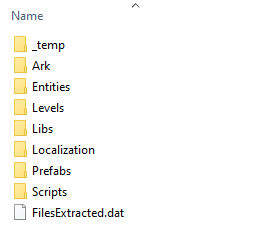
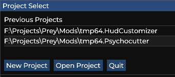

# Introduction
This series of articles will give you the information necessary to make basic mods for Prey (2017) using Chairloader Mod Loader.

If you have any questions, feel free to ask them over at the [Prey Discord Server](https://discord.gg/gTz5zpK) in `#prey-modding`.

# Modding basics
Prey is built using the CRYENGINE game engine. The "hard" game logic is written in C++ and is compiled into the *PreyDll.dll* binary file. But the most of the actual game settings are stored in various XML files in the game assets.

## Assets
Game assets are stored in `*.pak` files in the game folder. When running the game, all files from PAKs are combined into a single virtual file system. If a file with the same name exists in multiple PAKs, then PAKs loaded at a later point override files from earlier PAKs.

The game supports two types of PAK files.
1. Regular ZIP archives. You can read and write them using any archive tool (e.g. 7-Zip).
   - GOG and EGS versions use this format.
2. Encrypted PAKs. They can only be read by the game or special extraction tools.
   - Steam uses this format.

## Asset Patching
The game loads PAKs from `GameSDK\Precache` last. This lets you install custom PAKs in this folder with the name like `patch_[any name you want].zip` (e.g. `patch_chairloader.pak`). This is how most existing mods are installed into Prey.

> **Note:** `GameSDK\Precache` folder doesn't exist in EGS version but it's still supported if you make it manually.

## Asset Merging
As part of the modding process, you will need to edit XML files of huge sizes (sometimes thousands of lines long). If do this directly, not only will you go insane, but your mod will be incompatible with every other mod that modifies the same file.

Chairloader solves this problem. As a mod author, you only need to specify the changes to the game files. Chairloader will take all changes from all installed mods and will merge them into a single file.

# Making your first mod
## Prerequisites
### Required
To follow this guide, you must install Chairloader and make sure it works.
1. Install Chairloader
2. Open folder: `ChairManager/PreyFiles`. You should see `FilesExtracted.dat` and a set of folders.  
   

### Optional
Additionally, you can install a few tools to make modding easier.
1. [Visual Studio Code](https://code.visualstudio.com/)
2. [XML Extension for VS Code](https://marketplace.visualstudio.com/items?itemName=redhat.vscode-xml)
3. [indent-rainbow for VS Code](https://marketplace.visualstudio.com/items?itemName=oderwat.indent-rainbow)

## Option A. Using Preditor
> **This is the recommended option.**

Preditor is a mod editor for Prey. Each Preditor project runs in a separate environment. It lets you test mods independent from each other and without risk of damaging your save files.

> **Note:** At the moment, Preditor doesn't support level file merging. Use Chairloader for level mods for the time being.

1. [Enable Developer Mode in Windows](https://stackoverflow.com/a/58048888). This is required because Preditor uses symbolic links to reduce disk space usage when merging non-XML files.
   - If you can't enable Developer Mode or don't use Windows 10, you *MUST* run Preditor.exe as Administrator.
2. Open ChairManager folder.
3. Launch `Preditor.exe`. You should see the Project Select dialog.  
   
4. Press `New Project`.
5. Fill in the fields.
   - Mod Name. This is the internal name of the mod. It should look like `authorName.mySuperMod`.
   - Display Name. This is the name that the use will see. Example: `My Super Mod`
   - Author. This is your name. Example: `Myself`
   - Has a DLL. If you're making a DLL mod, tick this checkbox and type the DLL name.
   - Project Location. Where to place your mod.
   - Create Project Folder. If ticked, a new folder with the mod name will be created.
   
   
6. Press `Create`
7. Select your mod in the project list. This will open Preditor with just your mod loaded.
8. Adjust windows for your liking.  

??? info "Recommended Layout"

     

## Option B. Manually
1. Choose an internal name for your mod. It should look like `authorName.mySuperMod`.
2. Open Prey installation folder and then open `Mods` folder.
3. Create a folder with your mod's internal name (e.g. `authorName.mySuperMod`) in `Mods`.
4. Copy `Examples/AuthorName.ModExample/ModInfo.xml` from ChairManager to the created folder.
5. Open `ModInfo.xml` in a text editor (e.g. VS Code).
6. Adjust attributes to match your mod. See the descriptions above (in Option A. Using Preditor).
7. Open ChairManager
8. Install and Enable your mod.
9. Press `Save mod list` and `Merge mods`.

## What's next
Now that you have a mod, you can start modifying files. Follow the [Basic XML Mod](xml/basic-xml-mod.md) guide to get an idea on how XML mods work.