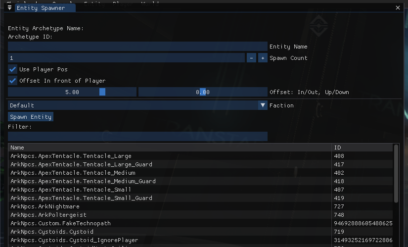
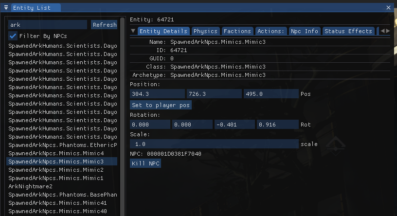
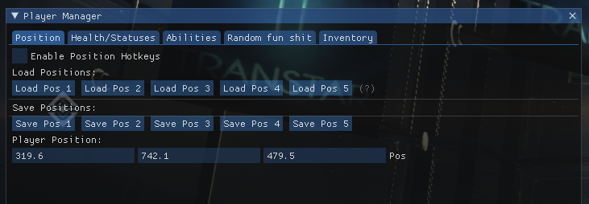
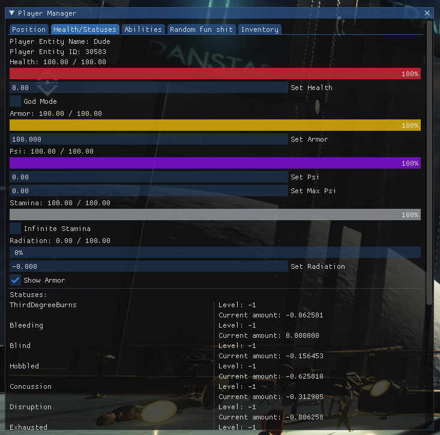
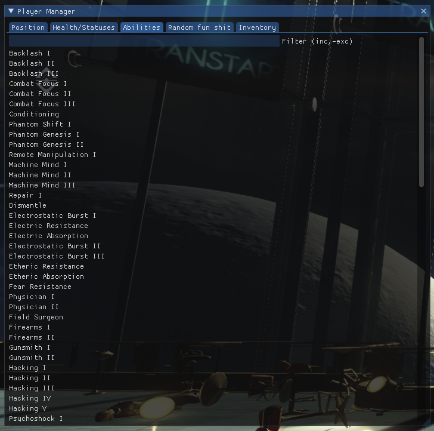
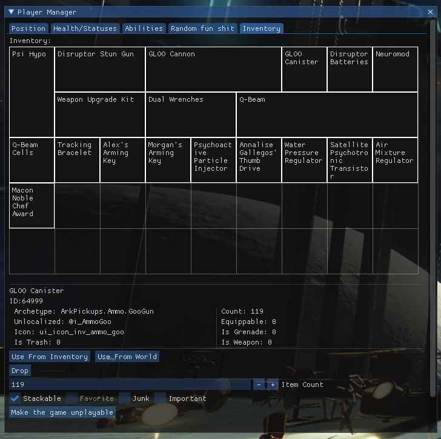
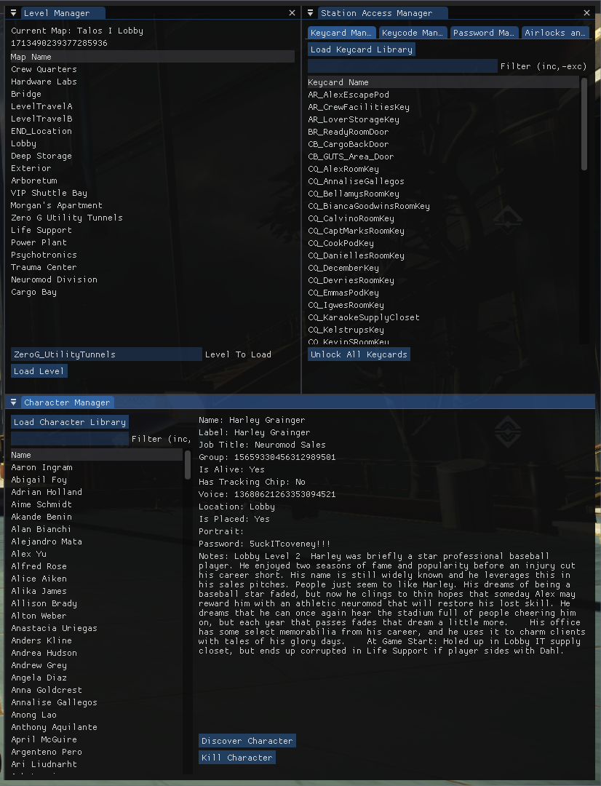

# Chairloader Tools
**These are internal modules that provide an array of useful functions in game. They possess many trainer-like features, including entity, player, and world manipulation. They are a statically linked library that is compiled into the main chairloader DLL.**

## Entity Manager
There are two primary functions in this module: the entity spawner and the entity list.

**The entity spawner is used to spawn entities. It can spawn any archetype that is loaded into the game, and can specify a position, faction, quantity, etc..**

**The entity list is a list of all entities in the game. It can be used to select entities and change their position, faction, and orientation. Additionally, for NPC's there are more options available.**

## Player Manager

### Position Setting and save/load

### Health, armor, psi, stamina, and status manipulation

### Menu for granting any neuromod in the game

### Inventory manipulation

### World Manager
- Can load any level from any position in the game
- Can unlock keycards, passcodes, and passwords
- Can view the entire character list and view dev notes. Can also set characters as discovered through the menu.
- *more coming soon!*

